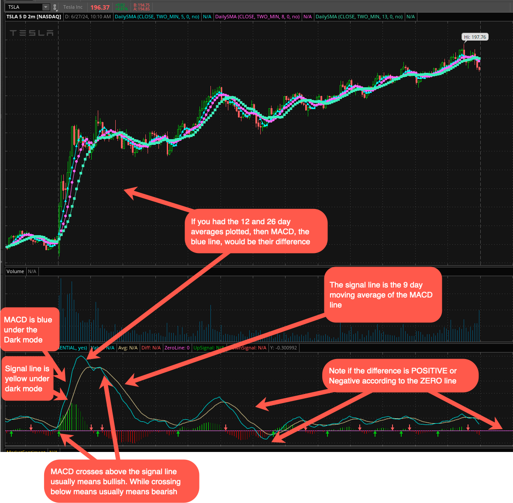

# The Moving Average Convergence Divergence (MACD) [Explanation from Investopia](https://www.investopedia.com/terms/m/macd.asp)

* Works similar to the SMA. It uses moving averages from different lengths to identify changes in momentum. For more context, see the  [Explanation from Investopia](https://www.investopedia.com/terms/m/macd.asp)

* Moving average convergence/divergence (MACD) is a trend-following momentum indicator that shows the relationship between two exponential moving averages (EMAs) of a security’s price. MACD was developed in the 1970s by Gerald Appel.  [MACD](../StockTrading/TDAmeritrade/StudiesAndStrategies/Studies/MACD.md) trys to show if a stock is over bought or under sold. [MACD](https://en.wikipedia.org/wiki/MACD) by [Geral Appel](https://cmtassociation.org/presenter/gerald-appel/) (He wrote [17 books](https://www.amazon.com/stores/author/B001ILKGMC) )

* The MACD line is calculated by the formula:  the 12-period exponential moving average (EMA) -  26-period (EMA) 
* The signal line is a nine-period EMA of the MACD line.
* MACD is best used with <ins>daily periods</ins>, where the traditional settings of 26/12/9 days is the default.

* The MACD line is calculated by subtracting the 26-period EMA from the 12-period EMA. **The calculation creates the MACD line**. <ins>A nine-day EMA of the MACD line</ins> **is called the signal line**, plotted on top of the MACD line, which can function as a trigger for buy or sell signals. Traders may <ins>buy the security when the MACD line crosses above the signal line</ins> and sell—or short—the security when the MACD line crosses <ins>below</ins> the signal line. MACD indicators can be interpreted in several ways, but the more common methods are crossovers, divergences, and rapid rises/falls.

The Signal Line  is calculated by applying an EMA to the MACD line, which smooths out the MACD's fluctuations and highlights the overall trend.  This smoothing effect reduces the impact of short-term volatility, providing a clearer view of the underlying momentum. <ins>The signal line helps traders by providing a secondary confirmation to the MACD line’s indications, thus reducing the likelihood of false signals and improving the reliability of trading decisions.</ins>

# Extended Ideas
## RSI vs MACD