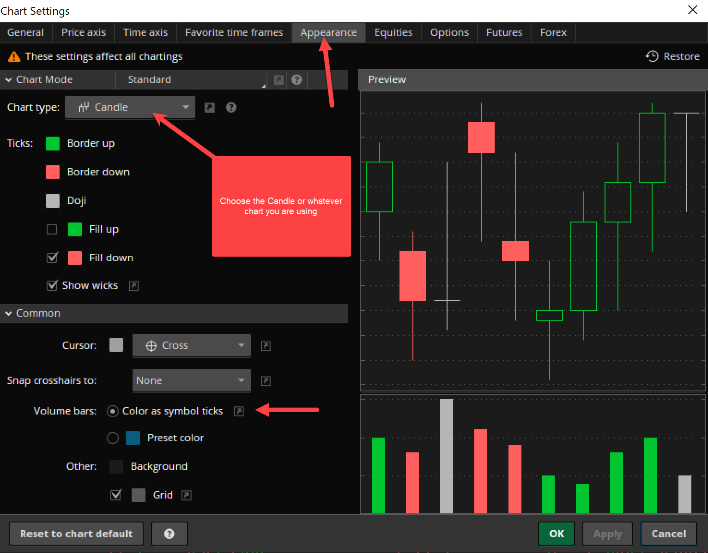
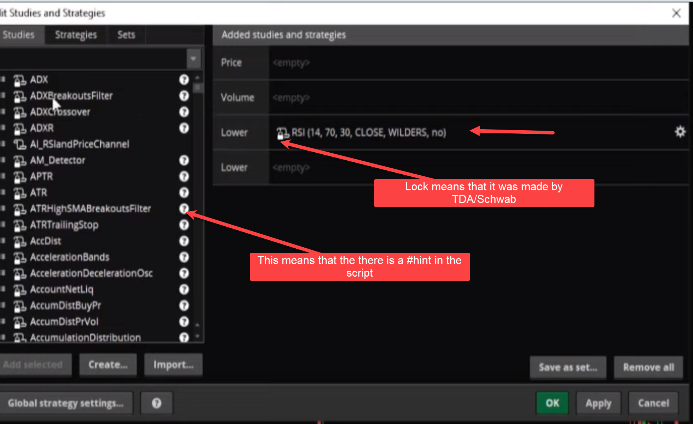

# Why?

- Have more than one stream of income.  Get ready for retirement in 2027.  Not about the pursuit of money but about having options.
- I want to optimize my time through quant trading and also make money. 

# Github repos

- [Td-Ameritrade](https://github.com/orgs/td-ameritrade/repositories)
- [lots of stars and many forks](https://github.com/jshingler/TOS-and-Thinkscript-Snippet-Collection)
- [4 years old](https://github.com/bingit2/TradingView-to-ThinkorSwim)
- [Old but thorough](https://github.com/hwrdprkns/ThinkOrSwim)
- [newer](https://github.com/2187Nick/thinkscript)
- [useThinkScript.com](https://usethinkscript.com/resources/categories/code-reference.2/)

# TOS docs and dev community

- <https://developer.tdameritrade.com/>
- [Charles Schwab bought TDAmeritrade and has this dev center](https://beta-developer.schwab.com/)
- [Guy who writes complex scripts](https://funwiththinkscript.com/adding-space-between-candles/)
- [Carl not Karl](https://usethinkscript.com/members/carl-not-karl.23790/#recent-content)

# Trading communities

- <https://bullishbears.com/> [Their picks read into a dataframe](https://github.com/erickbytes/russell-2000-index?tab=readme-ov-file)
- [Composer for AI algoritms](https://composer.trade)

# [Debugging and adding labels (link)](https://copyprogramming.com/howto/how-do-you-step-through-thinkscript-in-thinkorswim-platform)

- #According to @Gary, thinkScript does not come with a debugger tool. Gary recommends using chart bubbles and chart labels as alternatives. When a condition is met,
  `bubbles will appear on a designated bar within the chart, while labels will appear on the upper left corner of the same chart.`
- [You can have two instances of Think Or Swim Running at a time](https://toslc.thinkorswim.com/center/howToTos/thinkManual/Getting-Started/SCHW-How-to-Access-thinkorswim-When-You-Have-Accounts-at-Both-Ameritrade-and-Schwab). I think they have to share the same profile

# Stock Exchanges

- 
- New York Stock Exchange (NYSE): The NYSE is the largest stock exchange in the world, with a market capitalization of over $25 trillion as of 2021. It is located in New York City and is owned by the Intercontinental Exchange (ICE). The NYSE lists both domestic and international companies, and it is home to many well-known companies such as Apple, Microsoft, and ExxonMobil.
- NASDAQ: The NASDAQ is the second-largest stock exchange in the world, with a market capitalization of over $18 trillion as of 2021. It is based in New York City and is owned by the NASDAQ, Inc. The NASDAQ is known for its focus on technology companies, and it is home to many well-known tech companies such as Amazon, Facebook, and Google.
- London Stock Exchange (LSE): The LSE is the largest stock exchange in Europe and the third-largest in the world, with a market capitalization of over $6 trillion as of 2021. It is based in London, England and is owned by the London Stock Exchange Group (LSEG). The LSE lists both domestic and international companies, and it is home to many well-known companies such as HSBC, Unilever, and GlaxoSmithKline.
- Tokyo Stock Exchange (TSE): The TSE is the largest stock exchange in Asia and the fourth-largest in the world, with a market capitalization of over $5 trillion as of 2021. It is based in Tokyo, Japan and is owned by the Japan Exchange Group (JPX). The TSE lists both domestic and international companies, and it is home to many well-known companies such as Toyota, Sony, and Honda.

# Futures exchanges

- The Chicago Mercantile Exchange (CME) offers a variety of futures and options contracts that trade on a 24/6 basis, which means that they are available for trading 24 hours a day, six days a week. Some examples of tickers on the CME that trade 24/6 include:
-E-mini S&P 500 futures (/ES): As I mentioned earlier, the E-mini S&P 500 futures contract is a derivative product that is based on the value of the Standard & Poor's 500 index (S&P 500). The E-mini S&P 500 futures contract is one of the most widely traded futures contracts in the world, and it is available for trading on a 24/6 basis on the CME.
- E-mini NASDAQ-100 futures (/NQ): The E-mini NASDAQ-100 futures contract is a derivative product that is based on the value of the NASDAQ-100 index, which is a stock market index that measures the value of 100 of the largest and most actively traded non-financial stocks listed on the NASDAQ. The E-mini NASDAQ-100 futures contract is available for trading on a 24/6 basis on the CME.
- E-mini Dow futures (/YM): The E-mini Dow futures contract is a derivative product that is based on the value of the Dow Jones Industrial Average (DJIA), which is a stock market index that measures the value of 30 large-cap stocks listed on the NYSE and NASDAQ. The E-mini Dow futures contract is available for trading on a 24/6 basis on the CME.
- E-mini Russell 2000 futures (/TF): The E-mini Russell 2000 futures contract is a derivative product that is based on the value of the Russell 2000 index, which is a stock market index that measures the value of 2,000 small-cap stocks listed on the NYSE and NASDAQ. The E-mini Russell 2000 futures contract is available

# The Trade Tab

1. **All Products**: This subtab likely allows traders to access and trade all types of products offered by the platform, including stocks, options, futures, forex, and more.

2. **Forex Trader**: Dedicated to the foreign exchange (forex) market, this subtab would enable traders to engage in trading currency pairs, taking advantage of the fluctuations in currency exchange rates.

3. **Futures Trader**: This section is intended for trading futures contracts, which are standardized agreements to buy or sell a particular asset at a set price and date in the future.

4. **Active Trader**: Tailored for day traders or individuals who trade frequently, this subtab would provide tools for quick trade execution and real-time market data.

5. **Pairs Trader**: This subtab facilitates pairs trading, a strategy that involves taking simultaneous long and short positions in two highly correlated securities with the aim of profiting from the relative price movements.

# Market Capitalization means

- Market Capital = # of outstanding shares (includes all shareholders) * current share price. 

- To find the total outstanding shares and valuation, go to the "analyze" tab, click "fundamentals", and then look for "Total Shares Outstanding" and, "Market Cap."

# Units of Measure on a Stock Chart

- By default a Thinkscript script is calculated after every tick unless you use, `declare once_per_bar`

- Here is a table that compares and contrasts the three aggregation types: Time, Tick, and Range.

- Every time the price moves up or down within that specific timeframe (1 min, 5 min...), it can be considered a tick. So, if the price within a 5-minute candlestick chart moves from $10.00 to $10.05, it has experienced five ticks upward within that 5-minute period.

| Aggregation Type | Definition | Use Case | Granularity | Time-based | Price-based | Volume-based |
|------------------|------------|----------|-------------|------------|-------------|--------------|
| Time | Data is grouped based on a specific time interval, such as 1 minute, 5 minutes, 1 day, etc. | Useful for analyzing patterns over time and identifying trends based on standard time intervals. | Fixed intervals, less granular with longer time frames, more granular with shorter time frames. | Yes | No | No |
| Tick | Data is grouped based on a certain number of transactions or "ticks". | Helpful for traders interested in the details of market microstructure and price action at a granular level. | Very granular, each tick represents one transaction regardless of time. | No | No | Yes |
| Range | Data is grouped based on a price range, with each data point representing the time it takes for the instrument to move through a specified price range. | Beneficial for traders focusing on price consolidation and breakout patterns within specific price ranges. | Granularity depends on the specified price range; wider ranges are less granular, and narrower ranges are more granular. | No | Yes | No |

Each aggregation type serves different trading strategies and analysis preferences. Time-based aggregation is the most traditional and is useful for a broad range of analyses. Tick-based aggregation gives a detailed view of market dynamics and is typically used by high-frequency traders or those analyzing the market at a very fine level. Range-based aggregation is particularly used for identifying patterns that occur within certain price levels, such as support and resistance areas.
