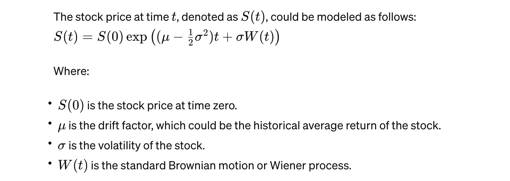

# Wolfram Alpha components

- See [your license entitlements](https://account.wolfram.com/products) and [wolfram Engine faq](https://www.wolfram.com/engine/faq/).  For a free basic license you get
  - Wolfram|Alpha (super search), Wolfram Cloud (web dev), Wolfram Engine (terminal), Service Credits
- You can only have one terminal instance of wolfram at a time.  You can see it by  `ps aux | grep 'Wolfram' | awk '{print $11}'`

# Brownian motion vs Markov Chains

- Markov Chains: A Markov chain is a stochastic process that satisfies the Markov property, meaning the future state depends only on the current state and not on the sequence of events that preceded it. Markov chains can be discrete or continuous in time, but they are characterized by this lack of memory about the past.

  - Markov Chain Example with Apple Stock
    Imagine we simplify the world and say that the daily closing price of Apple stock can only be in one of three states: Up, Down, or Unchanged, compared to the previous day. This is a discrete Markov chain because it has a finite number of states and the probability of moving to the next state depends only on the current state, not the sequence of events that led there. For simplicity, let's assign probabilities as follows: If the stock is Up today, there's a 50% chance it will be Up tomorrow, a 30% chance it will be Down, and a 20% chance it will be Unchanged.
    If the stock is Down today, there's a 40% chance it will be Up tomorrow, a 40% chance it will be Down, and a 20% chance it will be Unchanged.
    If the stock is Unchanged today, there's a 45% chance it will be Up tomorrow, a 25% chance it will be Down, and a 30% chance it will remain Unchanged. This simplistic model ignores a lot of real-world complexities but provides a framework for predicting the stock's movement based only on its current state.

- Brownian Motion (Wiener Process): Brownian motion is a continuous-time stochastic process that represents the random movement of particles in a fluid, but it's also used metaphorically to describe stock price movements and other financial variables. It has continuous paths, meaning it changes at every instant in time. A key characteristic of Brownian motion is that the changes in the process are independent and normally distributed with a mean of zero, which implies that future movements are unpredictable and not dependent on past movements. It's a fundamental process in the mathematical theory of stochastic processes and is used extensively in the modeling of random behavior in the financial markets, especially in the Black-Scholes model for option pricing.

- The primary difference lies in their structure and application: Markov chains are about the state-dependent transitions with the memoryless property, and can be either discrete or continuous, while Brownian motion is a continuous process that models the random movement with specific statistical properties. **Brownian motion is a specific type of Markov process with continuous paths**, showcasing how these concepts can overlap but are used differently depending on the context and the specific characteristics of the phenomena being modeled.

# Geometric Brownian Motion

- In Wolfram Alpha, or more broadly within the Wolfram Language used in Mathematica, to model a random stock price over time intervals, you would typically use a stochastic process model that is appropriate for financial time series. The Geometric Brownian Motion (GBM) model is a common choice for this purpose, as it is widely used to model stock prices in financial mathematics. The GBM model incorporates both

  - the drift (representing the average return) and
  - volatility (representing the price variability) of the stock.

- **The model is a specific case of the Wiener Process that you mentioned, with the addition that it models the logarithm of the stock price, ensuring that the stock price remains positive**.
