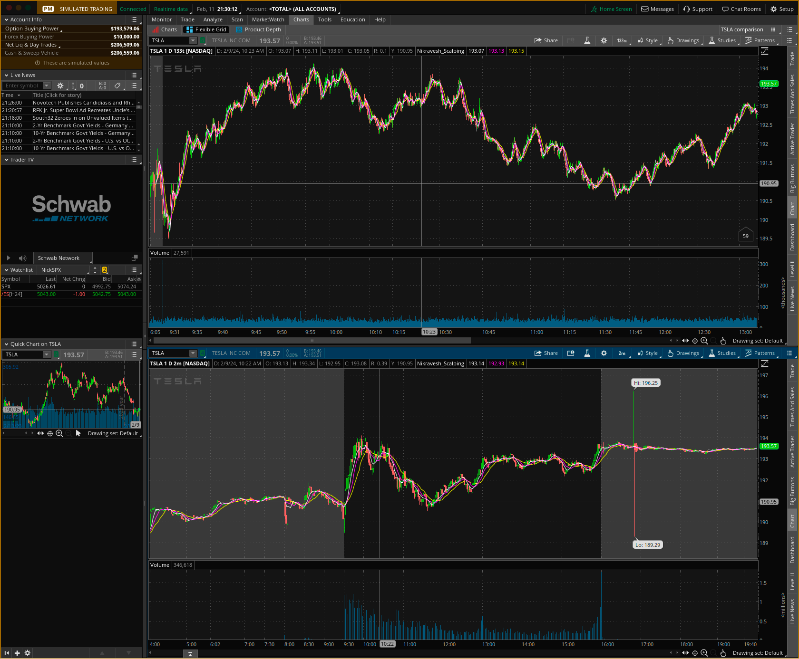

# Why?

- Have more than one stream of income. Get ready for retirement in 2027. Not about the pursuit of money but about having options.
- I want to optimize my time through quant trading and also make money. Time, Health, and doing what God wants.

# Manage Expectations

- It is probably going [to take 3 years](https://youtu.be/cbm-X8RfK5Y?t=303) to make money doing it full time. People who come into trading just to make money fast and impatiently usually don't make it.

- Every trader needs to find their way of trading. Plan your trade and work your plan. Be wrong fast and on a small bet.

# Meta Stock Ideas

- If you have the same conditions for a similar event then can you get 80% chance for the same result? 
- What are the three reasons stock prices move 1. Longs are selling, 2. Longs are buying, or 3. Shorts entering or covering
- Predefine your win so you can measure it. 
- Stop Losses: Thorp discusses the use of stop-loss orders to limit losses and protect capital in case a trade moves against expectations. He suggests setting predetermined exit points based on predefined criteria to avoid emotional decision-making during market fluctuations.
- 50-90% of Stock options expire worthless.  Being on the side of theta decay can be profitable--like insurance angents. When you sell options, you're essentially taking advantage of time decay (theta decay) because as time passes, the option loses value, particularly if it's out-of-the-money (OTM) or at-the-money (ATM). This time decay accelerates as the option approaches its expiration date.
- [The volume of traded stocks and options has been doubling every 5 years](https://youtu.be/A5w-dEgIU1M?t=1337)
- How large is the derivatives market? It's a vast area stemming from Black Scholes Merton. Estimates peg the size of derivatives markets globally at several hundred trillion dollars. How does this compare to the underlying securities they're based on? It's multiples of the underlying securities. It's quite astonishing to realize that there's more money invested in derivatives than in the assets they derive from. Options, for instance, allow for the creation of multiple versions of the underlying asset, tailored to individual risk-reward preferences. As for the impact on market stability and the global economy, it's a mixed bag. During normal times, derivatives markets provide significant liquidity and stability. However, during market stress, they can exacerbate downturns, leading to substantial crashes. In 1997, Merton and Scholes received the Nobel Prize in economics, acknowledging their contributions. Unfortunately, Black had passed away two years prior. Their work on the option pricing formula revolutionized finance, though it meant hedge funds had to find new ways to identify market inefficiencies.Enter Jim Simons. Before his foray into finance, he was a mathematician, renowned for his work in Riemann geometry and other fields. His approach at Renaissance Technologies in 1978 was to apply machine learning to uncover patterns in the stock market, drawing from his experience in breaking codes during the Cold War. Simons understood the complexity of markets and the uncertainty of predictions. Yet, he believed that by leveraging vast amounts of data and advanced mathematical models, it was possible to outperform the market—a conviction that would lead Renaissance to remarkable success.
-One notable figure in this narrative is Leonard Baum, credited as a pioneer of Hidden Markov models. Just as Einstein inferred the existence of atoms through their effect on pollen grains, Hidden Markov models seek to identify factors not directly observable but influencing what we can observe. Renaissance Technologies leveraged these models and other data-driven strategies when launching their Medallion fund—a move that would propel it to become the highest-returning investment fund in history. 
-This success led Bradford Cornell of UCLA to question the efficient market hypothesis in his paper "Medallion Fund: The Ultimate Counterexample?" He argued that the fund's performance suggested flaws in the hypothesis, challenging the notion of market efficiency. Further challenging this hypothesis, empirical research conducted by others, including the narrator, demonstrated predictability in the stock market. This finding implies that with the right models, training, resources, and computational power, it is indeed possible to outperform the market—a realization that disrupts traditional financial theory. Physicists and mathematicians, often at the forefront of discovering market patterns, have not only amassed wealth but also reshaped the financial landscape. By modeling market dynamics, they've advanced our understanding of risk and improved pricing accuracy for derivatives, thus reducing market inefficiencies. Ironically, the pursuit of uncovering all market patterns could ultimately lead to their elimination. Once fully understood, these patterns could be exploited, resulting in a perfectly efficient market where price movements are truly random.
- MACD trys to show if a stock is over bought or under sold. 
Certainly! Here's the updated table with blank spaces for the URLs:

| Study | Summary | Link | Consistently Outperformed the Market? |
|-------|---------|------|--------------------------------------|
| University of California, Berkeley | The study examined the performance of day traders and found that only about 10% were consistently profitable after accounting for trading costs. | | No |
| Brazilian School of Public and Business Administration (EBAPE) | This study estimated that less than 1% of day traders consistently outperformed the market over a five-year period. | | No |
| Barber, Lee, Liu, and Odean (Taiwan Study) | The research analyzed individual day traders in Taiwan and concluded that, on average, they experienced significant losses after considering trading costs. | | No |
| Garvey and Murphy | This study investigated U.S. equity day traders and found that the vast majority experienced negative returns, with only a small percentage achieving consistent profits. | | No |
| Barber, Lee, Liu, and Odean (Cross-Section of Speculator Skill) | The study examined day traders in the U.S. equity markets and found that while some exhibited skill, most did not, leading to negative overall returns after trading costs. | | No |

You can fill in the URLs by searching for the studies using their titles and authors on academic databases or publisher websites.

# Important Definitions

- One way to think about this in the sea of supply and demand is the degrees of freedom one has in each dimension.  You start with multiple stock markets and pick a stock market that sells stocks--which are a portion of the company.  Stock/shares can be preferred (internal with time constraints) or public. Total shares * price per share is tthe Market Cap or value of the business.  If the stock is traded then it has price-movement, the volume that is traded, volatility of the price, and a bid-ask spread.  If those are healthy then you get an efficient market where traders can trade and make strategies about those dimensions using just that stocks, multiple stocks, or stocks across multiple stock markets.  

- **Stock Market** The stock market isn't like a store where everyone pays the same set price. It's actually a giant
  live auction unfolding at warp speed. So the current stock quote a second ago may not be the same as now. The quote isn't the stock's current price it's just the last price at which it was traded. Use the bid and ask prices for a better idea of a stock's going rate. Knowing that you have buyers (non-owners) and sellers (owners) of the stock. Fundamentally, everyone wants to make money when they enter a transaction. So the ask>= market price>=bid. The closer they are together the more efficient the market.

  - **float** - number of shares available for trading on the open market. Low float stocks can be subject to higher volatility due to their limited supply. When there's a high demand for a stock with a low float, the price can move up rapidly because there are not enough shares available to meet the demand. Link to [find low float with finviz](https://thinkscript101.com/low-float-stock-scanner-thinkorswim/)
    - Percentage = Classification  
    - Below 10%  = Very Low Float
    - 10% - 20%  = Low Float
    - 20% - 50%  = Moderate Float
    - Above 50%  = High Float

  - **bid price** (if they could buy it) is the maximum amount that buyers in the market are willing to pay.

    - **Buying the Bid**--placing an order at the bid price--means you are willing to pay up to that price. When you buy at the bid price, you are hoping that a seller will eventually agree to sell you the security at that price or lower. Buying at the bid price can be a good strategy if you are willing to wait for a better price. However, it is important to remember that you may not always get your order filled at the bid price, especially in volatile markets.

  - **ask price** (if they had it and could sell it) is the minimum amount that sellers in the market are willing to accept
    - **selling the ask**-- If you place a sell order at 15.05 for a stock with a bid price of 15 and an ask price of $15.10, you will be selling at the ask price. Here's why:
      - Order book mechanics: The order book matches buy and sell orders based on price and time priority. Orders at the best price (highest bids and lowest asks) get filled first.
      - Your ask price vs. market prices: Your ask price of 15.05 is lower than the current ask price of 15.10, but it's higher than the best bid price of $15.
      - Filling at the best available price: Since your ask price is better than the available bids but worse than the available asks, you will be matched with the best available ask, which in this case is the current ask price of $15.10. Therefore, even though your intention was to sell slightly below the ask price, the market will always prioritize filling orders at the best available price to ensure efficient execution.
  - **"market order"** to buy a stock, the order is typically executed at the ask price. A market order is an instruction to buy or sell a security immediately at the best available current price, which for a buy order is the lowest price sellers are currently willing to accept (the ask price).

**Spread** is the difference beteen the above. (**a consistently wide bid-ask spread can be a sign of several factors, including low trading volume, low liquidity, high volatility, or news or events**)

**Buy Market:** This button sends an immediate buy order at the current market price. It's the fastest way to buy a security but doesn't guarantee the exact price you'll get.

**Sell Market:** This button sends an immediate sell order at the current market price, similar to Buy Market but for selling.

**Buy Ask:** This button sends a buy order at the current ask price, which is the lowest price sellers are willing to accept. Unlike market orders, it guarantees the ask price but might take slightly longer to fill if the market price moves quickly.

**Cancel...:** This opens a menu where you can cancel specific pending orders or open positions.

**Buy Bid:** This button sends a buy order at the current bid price, which is the highest price buyers are willing to pay. Similar to Buy Ask, it guarantees the bid price but might take longer to fill.

**Reverse:** This button flips the current order (buy to sell or sell to buy) while keeping the same price. Essentially, it lets you quickly change your mind without having to enter a new order.

**Flatten:** This closes all open positions for the selected security, regardless of whether they are long (buy) or short (sell). Use this to exit all your holdings in a particular security.

**Cancel All:** This cancels all pending orders for the selected security, without affecting any existing open positions.

Remember, using these buttons effectively requires understanding market dynamics and your trading strategy. Don't hesitate to practice on a demo account or consult resources from Thinkorswim before using them with real money.

**Volatility** The ["Intraday Volatility Study,"](https://www.sec.gov/divisions/marketreg/mr-rule-tabs/intraday-volatility-study-final-report) from 2015 and examined intraday volatility in the U.S. equity markets from January 2010 to June 2014. The study found that

- the first and last hour of trading are the most volatile period of the trading day, with an average STDEV of 0.87%, compared to an average STDEV of 0.75% for the entire trading day.
- volatility was elevated during the last hour of trading, with an average STDEV of 0.82%, and during specific market events, such as earnings announcements or economic data releases.
- However, this does not predict the future.

- Volatility usually brings more volume because it brings more opportunity, unless the volume is so high traders back off. Increased volume usually reduces the bid-ask spread

**Time Interval** - VERY important!  Which interval (ticks, 2 min, 5 min,..) provides a good balance of high-fidelity, short-term information while smoothing out the variance of micro-fluctuations in the stock that are not indicative of a larger trend.

## Trading Strategies in Order of statistical profitability

Certainly! Here are the statistically probable day trading strategies listed in ranked order based on their historical effectiveness and probability of success:

1. **Breakout Trading**: Breakout trading ranks first due to its high potential for capturing significant price movements when the price breaks out of key support or resistance levels with high volume. Breakouts often lead to sustained trends, providing favorable risk-to-reward opportunities for traders.

2. **Pullback Trading**: Pullback trading ranks second as it allows traders to enter trades in the direction of the prevailing trend at better prices following temporary retracements or pullbacks. Pullbacks within strong trends statistically have a higher probability of leading to trend continuation.

3. **Gap Trading**: Gap trading ranks third as it capitalizes on price gaps that occur when the market opens higher or lower than the previous day's close. Statistically, price gaps tend to get filled, providing trading opportunities for traders to profit from the price returning to pre-gap levels.

4. **Mean Reversion Trading**: Mean reversion trading ranks fourth as it focuses on identifying overbought or oversold conditions in the market and entering trades based on the expectation of price returning to its average or mean levels. While mean reversion trades can be profitable, they may require patience and discipline to wait for price reversals.

5. **Volume Analysis**: Volume analysis ranks fifth as it helps traders gauge the strength of price movements and identify potential reversal or continuation patterns based on trading volume. High-volume price movements statistically have a higher probability of being sustained compared to low-volume movements.

6. **Pattern Recognition**: Pattern recognition techniques rank sixth as they involve identifying chart patterns, candlestick patterns, and harmonic patterns to anticipate potential trend reversals or continuation patterns. While patterns can provide valuable insights, they may require subjective interpretation and confirmation from other indicators.

## Tradeable Entities that are created from the underlying stock

- There are OTC (over-the-counter) and ETF (exchange-traded-funds) 

OTCs
S - Interest Rate Swaps 
F - Forwards

Exchange-traded funds (ETFs) cover a wide range of asset classes, including:

1. Stock ETFs: These track the performance of a specific stock market index or sector.
2. Bond ETFs: These invest in fixed-income securities like government, municipal, or corporate bonds.
3. Commodity ETFs: These track the price movements of physical commodities like gold, silver, oil, or agricultural products.
4. Currency ETFs: These follow the performance of foreign currencies or currency baskets.
5. Real Estate ETFs: These invest in real estate investment trusts (REITs) or real estate companies.
6. Sector ETFs: These focus on specific sectors of the economy, like technology, healthcare, or energy.
7. International ETFs: These invest in foreign stocks or bonds, providing exposure to global markets.
8. Leveraged and Inverse ETFs: These use derivatives to amplify returns or provide inverse exposure to an underlying index or asset.
9. Multi-Asset ETFs: These invest in a combination of different asset classes, providing diversified exposure within a single fund.
10. Thematic ETFs: These target specific investment themes or trends, such as renewable energy, cybersecurity, or robotics.

Over-The-Counter (OTC) funds
- One example of a swap is an interest rate swap. In this type of swap, two parties agree to exchange interest rate payments, typically where one party pays a fixed interest rate and the other pays a floating (variable) interest rate. This can be used by entities to manage interest rate risk or to take advantage of differences in interest rate expectations.
-Forwards

## protecting your trades

https://youtu.be/un-K-cUeang?t=1125

- [Link to limit vs stop](https://tokenist.com/investing/what-is-a-limit-order-in-stocks/)
  - During extended trading hours (outside of 9:30-4:30), you can only use limit orders with with TIF(Time in Force)=EXT
  - Template types - allow you to add your stop losses and OCO (on cancel order)
- [Link to TD Ameritrade explanation](https://www.youtube.com/watch?v=_EEvTGA-K6Q)
- **Key Differences:** [See bard ai link](https://g.co/bard/share/20f394040c5a)

| Feature     | Stop Order (protect)                  | Limit Order (Take profits)         |
| ----------- | ------------------------------------- | ---------------------------------- |
| Trigger     | Price reaches stop price              | Price reaches limit price          |
| Execution   | Guarantees execution, not price       | Guarantees price, not execution    |
| Order type  | Becomes a market order when triggered | Remains a limit order until filled |
| Primary use | Protection or breakout entry          | Price control                      |

**Choosing the Right Order:**

- **Stop orders** are primarily for risk management and position entry based on price triggers.
- **Limit orders** are for controlling the price you pay or receive, but they might not guarantee execution if the market doesn't meet your price.

# Contributors to price action

You're right, volume, news, and trend are definitely three important indicators that influence stock price action, but it's worth considering the nuances of each and some additional factors that can contribute:

**Volume:**

- **High volume:** Often reflects increased buying or selling pressure, indicating potential momentum in the price movement.
- **Low volume:** Can suggest a lack of conviction among investors, leading to potentially choppy or sideways price action.
- **Spike in volume:** May accompany sudden news or events, signaling a possible trend change.

**Liquidity:** Metrics used to assess stock liquidity on platforms :

- **Volume**: Indicates the average number of shares traded daily. Higher volumes suggest more liquidity. - **> 1 million shares/day**
- **Float**: The number of shares available for public trading. A larger float typically means more liquidity. **see Above (30-50%)**
- **Bid-Ask Spread**: The difference between the highest price a buyer is willing to pay (bid) and the lowest price a seller is willing to accept (ask). A narrower spread signifies higher liquidity. **A few cents**

These metrics help investors understand how easily they can buy or sell a stock without causing a significant price change.

**News:**

- **Positive news:** Can trigger buying interest, pushing the price up. Examples include strong earnings reports, product launches, or favorable regulatory changes.
- **Negative news:** Can prompt investors to sell, leading to a price decline. Examples include missed earnings targets, product recalls, or legal troubles.
- **Market sentiment:** Broader market conditions and investor confidence can also be influenced by news events, impacting individual stock prices.

**Trend:**

- **Upward trend:** Suggests sustained buying pressure, with higher highs and higher lows over time.
- **Downward trend:** Indicates selling pressure, with lower lows and lower highs over time.
- **Range-bound trend:** Price fluctuates within a defined range, lacking momentum in either direction.

**Additional factors:**

- **Interest rates:** Changes in interest rates can affect the attractiveness of stocks relative to other investments, impacting demand and price.
- **Economic data:** Economic indicators like GDP growth, unemployment rate, and inflation can influence investor sentiment and stock prices.
- **Geopolitical events:** Wars, political instability, and international trade disputes can create uncertainty and lead to market volatility.

Remember, stock price action is complex and rarely driven by a single factor. Analyzing all these indicators together and understanding their interdependencies can help you form a more informed perspective on potential market movements.

# Github repos

- [Td-Ameritrade](https://github.com/orgs/td-ameritrade/repositories)
- [lots of stars and many forks](https://github.com/jshingler/TOS-and-Thinkscript-Snippet-Collection)
- [4 years old](https://github.com/bingit2/TradingView-to-ThinkorSwim)
- [Old but thorough](https://github.com/hwrdprkns/ThinkOrSwim)
- [newer](https://github.com/2187Nick/thinkscript)
- [useThinkScript.com](https://usethinkscript.com/resources/categories/code-reference.2/)

# TOS docs and dev community

- <https://developer.tdameritrade.com/>
- [Charles Schwab bought TDAmeritrade and has this dev center](https://beta-developer.schwab.com/)
- [Guy who writes complex scripts](https://funwiththinkscript.com/adding-space-between-candles/)
- [Carl not Karl](https://usethinkscript.com/members/carl-not-karl.23790/#recent-content)

# Trading communities

- <https://bullishbears.com/> [Their picks read into a dataframe](https://github.com/erickbytes/russell-2000-index?tab=readme-ov-file)
- [Composer for AI algoritms](https://composer.trade)

# [Debugging and adding labels (link)](https://copyprogramming.com/howto/how-do-you-step-through-thinkscript-in-thinkorswim-platform)

- #According to @Gary, thinkScript does not come with a debugger tool. Gary recommends using chart bubbles and chart labels as alternatives. When a condition is met,
  `bubbles will appear on a designated bar within the chart, while labels will appear on the upper left corner of the same chart.`
- [You can have two instances of Think Or Swim Running at a time](https://toslc.thinkorswim.com/center/howToTos/thinkManual/Getting-Started/SCHW-How-to-Access-thinkorswim-When-You-Have-Accounts-at-Both-Ameritrade-and-Schwab). I think they have to share the same profile

# Stock Exchanges

- 
- New York Stock Exchange (NYSE): The NYSE is the largest stock exchange in the world, with a market capitalization of over $25 trillion as of 2021. It is located in New York City and is owned by the Intercontinental Exchange (ICE). The NYSE lists both domestic and international companies, and it is home to many well-known companies such as Apple, Microsoft, and ExxonMobil.
- NASDAQ: The NASDAQ is the second-largest stock exchange in the world, with a market capitalization of over $18 trillion as of 2021. It is based in New York City and is owned by the NASDAQ, Inc. The NASDAQ is known for its focus on technology companies, and it is home to many well-known tech companies such as Amazon, Facebook, and Google.
- London Stock Exchange (LSE): The LSE is the largest stock exchange in Europe and the third-largest in the world, with a market capitalization of over $6 trillion as of 2021. It is based in London, England and is owned by the London Stock Exchange Group (LSEG). The LSE lists both domestic and international companies, and it is home to many well-known companies such as HSBC, Unilever, and GlaxoSmithKline.
- Tokyo Stock Exchange (TSE): The TSE is the largest stock exchange in Asia and the fourth-largest in the world, with a market capitalization of over $5 trillion as of 2021. It is based in Tokyo, Japan and is owned by the Japan Exchange Group (JPX). The TSE lists both domestic and international companies, and it is home to many well-known companies such as Toyota, Sony, and Honda.

# Futures exchanges

- The Chicago Mercantile Exchange (CME) offers a variety of futures and options contracts that trade on a 24/6 basis, which means that they are available for trading 24 hours a day, six days a week. Some examples of tickers on the CME that trade 24/6 include:
  -E-mini S&P 500 futures (/ES): As I mentioned earlier, the E-mini S&P 500 futures contract is a derivative product that is based on the value of the Standard & Poor's 500 index (S&P 500). The E-mini S&P 500 futures contract is one of the most widely traded futures contracts in the world, and it is available for trading on a 24/6 basis on the CME.
- E-mini NASDAQ-100 futures (/NQ): The E-mini NASDAQ-100 futures contract is a derivative product that is based on the value of the NASDAQ-100 index, which is a stock market index that measures the value of 100 of the largest and most actively traded non-financial stocks listed on the NASDAQ. The E-mini NASDAQ-100 futures contract is available for trading on a 24/6 basis on the CME.
- E-mini Dow futures (/YM): The E-mini Dow futures contract is a derivative product that is based on the value of the Dow Jones Industrial Average (DJIA), which is a stock market index that measures the value of 30 large-cap stocks listed on the NYSE and NASDAQ. The E-mini Dow futures contract is available for trading on a 24/6 basis on the CME.
- E-mini Russell 2000 futures (/TF): The E-mini Russell 2000 futures contract is a derivative product that is based on the value of the Russell 2000 index, which is a stock market index that measures the value of 2,000 small-cap stocks listed on the NYSE and NASDAQ. The E-mini Russell 2000 futures contract is available

# The Trade Tab

1. **All Products**: This subtab likely allows traders to access and trade all types of products offered by the platform, including stocks, options, futures, forex, and more.

2. **Forex Trader**: Dedicated to the foreign exchange (forex) market, this subtab would enable traders to engage in trading currency pairs, taking advantage of the fluctuations in currency exchange rates.

3. **Futures Trader**: This section is intended for trading futures contracts, which are standardized agreements to buy or sell a particular asset at a set price and date in the future.

4. **Active Trader**: Tailored for day traders or individuals who trade frequently, this subtab would provide tools for quick trade execution and real-time market data.

5. **Pairs Trader**: This subtab facilitates pairs trading, a strategy that involves taking simultaneous long and short positions in two highly correlated securities with the aim of profiting from the relative price movements.

# Market Capitalization means

- Market Capital = # of outstanding shares (includes all shareholders) \* current share price.

- To find the total outstanding shares and valuation, go to the "analyze" tab, click "fundamentals", and then look for "Total Shares Outstanding" and, "Market Cap."

# Units of Measure on a Stock Chart

- By default a Thinkscript script is calculated after every tick unless you use, `declare once_per_bar`

- Here is a table that compares and contrasts the three aggregation types: Time, Tick, and Range.

- Every time the price moves up or down within that specific timeframe (1 min, 5 min...), it can be considered a tick. So, if the price within a 5-minute candlestick chart moves from $10.00 to $10.05, it has experienced five ticks upward within that 5-minute period.

| Aggregation Type | Definition                                                                                                                                              | Use Case                                                                                                     | Granularity                                                                                                              | Time-based | Price-based | Volume-based |
| ---------------- | ------------------------------------------------------------------------------------------------------------------------------------------------------- | ------------------------------------------------------------------------------------------------------------ | ------------------------------------------------------------------------------------------------------------------------ | ---------- | ----------- | ------------ |
| Time             | Data is grouped based on a specific time interval, such as 1 minute, 5 minutes, 1 day, etc.                                                             | Useful for analyzing patterns over time and identifying trends based on standard time intervals.             | Fixed intervals, less granular with longer time frames, more granular with shorter time frames.                          | Yes        | No          | No           |
| Tick             | Data is grouped based on a certain number of transactions or "ticks".                                                                                   | Helpful for traders interested in the details of market microstructure and price action at a granular level. | Very granular, each tick represents one transaction regardless of time.                                                  | No         | No          | Yes          |
| Range            | Data is grouped based on a price range, with each data point representing the time it takes for the instrument to move through a specified price range. | Beneficial for traders focusing on price consolidation and breakout patterns within specific price ranges.   | Granularity depends on the specified price range; wider ranges are less granular, and narrower ranges are more granular. | No         | Yes         | No           |

Each aggregation type serves different trading strategies and analysis preferences. Time-based aggregation is the most traditional and is useful for a broad range of analyses. Tick-based aggregation gives a detailed view of market dynamics and is typically used by high-frequency traders or those analyzing the market at a very fine level. Range-based aggregation is particularly used for identifying patterns that occur within certain price levels, such as support and resistance areas.

Using ticks as an aggregation period instead of time can provide several advantages for traders:

1. **Market Volatility Insight**: Tick charts reflect market volatility by showing price changes as they happen, offering insights into the intensity of buying or selling.

2. **Non-Time-Based Analysis**: Tick charts focus on price movement, not the passage of time, which can reveal patterns during periods of rapid trading that might not be visible on time-based charts.

3. **Identify Market Momentum**: Large numbers of transactions (ticks) in a short period can indicate strong buying or selling pressure, providing a visual representation of market momentum.

4. **Avoid Irrelevant Information**: During slow trading periods, time-based charts can have little to no movement, while tick charts only create new bars when transactions occur, thus filtering out periods of inactivity.

5. **Customization for Strategy**: Traders can customize the number of ticks to match their trading strategies for more precise entries and exits.

# Common Tick numbers

- Common tick chart settings are 144, 233, and 512 ticks. The number 512 is mentioned as a standard or common setting that many traders use due to its balance of detail and smoothness in representing price action. Traders might choose different settings based on the specific market they are trading, the average volume, and their own trading style. For less active markets, traders might use a smaller tick size, such as 233 ticks, whereas more active markets might warrant a larger tick size like 512​​.

# Choosing between Tick and Time-based

- Choosing between a tick chart and a time-based chart like the two-minute chart depends on your trading style and what information you find most valuable for making decisions.

The tick chart, with all volume data consolidated into individual trades, can be especially useful for short-term or day traders who are looking for detailed information on market momentum and liquidity. It allows you to see the exact volume of shares traded with each transaction, which can indicate the strength of a price movement. If a large volume is traded within a few ticks, it might suggest a stronger move than if that same volume were spread out over many ticks.

The two-minute chart, on the other hand, provides a more smoothed out view of the market. It shows you the average activity over a set period, which can be easier to analyze for trends without getting caught up in the noise of every single trade. It's particularly useful if you're less concerned with the micro-movements of the market and are focusing on a slightly longer time frame within the day.

So, if you're looking for granular details and immediate execution, the tick chart might be more appropriate. If you're interested in the pace and sustained trends of trading activity over minutes, the two-minute chart could be more beneficial. It's all about the level of detail you need and the speed at which you're making trading decisions. Does that help clarify why you might choose one chart over the other?

# Scanners

- You can create your own scanners. (You can ONLY add a study filter in Actual trading).
  - Trey sorts by volume.
- use the link color to link the scanners

# Stock Apis

- https://medium.com/coinmonks/free-stock-apis-de8f13619911
