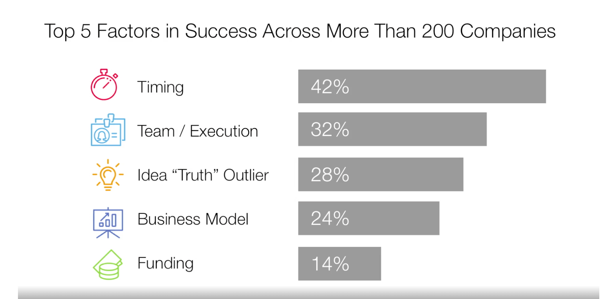

# Purpose of this document

 I want to make up a .json file that has all the attributes and questions I want to show the busineess has alignment.  Then a test should run over it.

* [Ted Talk on why startups succeed](https://www.ted.com/talks/bill_gross_the_single_biggest_reason_why_start_ups_succeed)

<!-- markdownlint-disable-next-line MD025 -->
# [Summary of Business Made Simple](https://waiyancan.com/business-made-simple-summary-donald-miller/)

Most people enter their professions without properly understanding how to grow a business. At times, this makes them feel lost, or worse, like a fraud pretending to know what they’re doing. It’s hard to be successful without a clear understanding of how business works.

Donald Miller, the CEO of StoryBrand, best-selling author and public speaker, learned to rise to the top using the principles he shares in, "Business Made Simple." He teaches the ten areas we need to excel to grow our career and create a profitable company. They are:

1. Leadership
1. Productivity
1. Strategy
1. Messaging
1. Marketing
1. Communication
1. Sales
1. Negotiation
1. Management
1. Execution
1. Unique Selling Proposition

## #1 Leadership Made Simple

All good leaders are good communicators and visionaries who can excite and unite a team, even in the times of confusion and uncertainty. In a nutshell, to lead is to:

1. Invite a team into a story.
1. Explain why the story matters.
1. Give every team member a role to play in the story.

### Great leaders know how to tell a great story

To tell a great story, use the following formula:

1. Start with the problem that’s pressing you or your company.
1. Agitate that problem to make it even bigger.
1. Position yourself, your company or your product as the resolution.
1. Describe the happy ending people will experience after the resolution.

This simple four-step formula has been proven over and over to engage almost any audience. When you filter the facts of your company through this story formula, all that’s left is good stuff. Here’s a story in action:

> “Most people hate leaving their pet at a kennel when they travel. They feel guilty as they picture their lovable pup’s sad eyes watching and waiting behind the bars of a cage until they return.
> At Pet-Paws Paradise, we play with your pet for at least eight hours each day so they’re constantly preoccupied and happy while you travel. They go to bed each night exhausted, dreaming of all the fun they had that day.
> When you leave your pet with us, you know your pet is safe and happy so you can feel great like the terrific pet owner you are!”
> Now, that’s a story that will attract potential employees, customers and investors.

* __Great leaders communicate why your work is important.
Most people work for more than a paycheck. They want to contribute to a mission that is meaningful.__ To convince people our mission matters, we need to define a theme. The theme of Schindler’s List, for example, is that every human being has infinite value and should be saved. As the screenwriters wrote the screenplay, they had to filter every scene through that central idea.

For a business, a theme can be anything from ‘nobody should pay a fortune for a new roof’ to ‘every family deserves a vacation they’ll never forget’. When you define your theme and communicate religiously, everybody will know why they are here and how they are contributing.

## 2 Productivity Made Simple

* The key to accomplishing more in less time is to know your objectives with highest return and to prioritize them above all.

* Productive people say no to distractions.
They do so so that they can say yes to stuff that matters. Just like a great communicator knows what to leave out, a productive professional knows what to say no to.

* Take Stephen King for example. The primary reason King has been able to write so many successful books is that he hardly took any speaking events. Each morning he shows up at his desk, turns on his computer and writes his daily quota of words. He was able to do so because he said ‘no’ to many terrific opportunities. Still today, millions of people know and love his work.

* Productive people know how to block time. Bill Gates is said to be never late to a meeting. When asked, he said, “Because time is the one finite resource I can’t buy more of.”

* Sadly, most people don’t pay attention to how they manage their time. We would never let anyone manage our wallet so why would we let them do it with our time? When you block periods of time in which you cannot be distracted, you’re somehow getting into the fast lane and pressing the gas pedal. The most productive people block their time weeks in advance, so they don’t accidentally book a meeting during a block for family and friends.

## 3 Strategy Made Simple

A business works like a plane. How do you know if a business is going to crash or soar? The answer to this question lies in understanding the dynamics of flight.

### The Body – Overhead

The body of the plane is where you put people and cargo. The whole point of this area is to get people where they need to go. This is also why a business exists – to solve a problem for customers. Overhead  includes salaries, medical benefits, rent, office supplies and so on. They are necessary because it takes people as well as resources to solve the problems efficiently.

### The Wings – Products and Services

The wings give the plane a lift. Your products and services are what give your business a lift. Think of the products you sell as the wings. Without profitable products to sell, no air (revenue) can lift the airplane off the ground.

### The Left Engine – Marketing

The engines thrust the plane forward. Without engines, the wings cannot lift the plane. Some kind of marketing system or sales team needs to thrust the business forward. Of the two engines, your marketing engine should come first because it’s usually cheaper and without it, your sales engine will not have a clear message out in the marketplace.

### The Right Engine – Sales

When you fire that second engine up, the plane moves with even greater thrust and gets more lift. Your second engine solves even more problems for your customers so your plane can bring in even more money to grow and scale.

### Fuel – Capital and Cash Flow

The plane won’t fly without a fuel, no matter how efficient you make it to be. Fuel represents cash flow. A business may wobble a little when it runs out of cash, but eventually it will crash and everybody on board will lose their livelihoods. Having enough cash is by far the most important factor leading your business to success.

Great strategists understand the plane metaphor.
Here are some things great strategists keep in mind as they run a company or a department:

They’re resistant to adding costs (especially recurring costs) to overhead. They get daily or weekly reports that reveal whether marketing and sales efforts are performing effectively. They make sure the profit margins on the products are high enough to cover the overheads. They’re constantly increasing the efficiency of their production, sales and marketing.

## 4 Messaging Made Simple

TODo: <https://waiyancan.com/summary-building-a-storybrand-by-donald-miller/>

A clear and compelling message has a potential to sell millions. Yet the hardest thing to do as a professional is to get people’s attention. Here’s a proven formula you can use to create great marketing messages, give terrific presentations and grab the attention.

1. The hero, who wants something.
1. The hero encounters a problem.
1. The hero meets the guide.
1. The guide gives the hero the plan.
1. The guide calls the hero to action.
1. The hero takes the action and succeeds.
1. The hero doesn’t take the action and fails.

Here’s an example in action:

1. Every bride wants a beautiful wedding cake that reflects the  meaning of the moment.
1. The problem is that most wedding cakes taste terrible and 1. literally leave a bad taste in the mouths of guests.
1. At Eighth Street Bakery, we got tired of bad-tasting wedding  cakes and developed a process in which gorgeous wedding cakes can actually taste fantastic.
1. To work with us, simply make an appointment, come by the shop for a taste testing and schedule your cake for delivery.
1. Schedule your appointment today.
1. If you do, your guests will be astonished at the beauty of your cake and keep coming back for seconds.
1. Don’t let your cake be a bad-tasting letdown. Schedule an  appointment today.

Now that’s a sales (and marketing) pitch. It can be used almost everywhere, in presentations, websites, brochures, emails and even in a video.

## 5 Marketing Made Simple

Todo: <https://waiyancan.com/marketing-made-simple-summary/>

Not every professional works in marketing but every professional needs to know enough about marketing so they can get their messages out to the world. Of course, marketing isn’t just about delivering messages to customers. It’s also about delivering messages to coworkers, investors and even the press and media.

### Great marketers know how to craft a one-liner

The idea of a one-liner originated from the movie industry. Whenever a screenwriter writes a screenplay, they have to summarize the story so producers want to invest in and potentially thousands will go to theatres to see it. Your one-liner has three components:

1. Problem
1. Solution
1. Result

Here’s a one-liner in action: “You know how most families don’t eat together and when they do they don’t eat healthy? I’m an at-home chef. I cook in people’s homes so they can eat well and spend more time with each other.

### Great marketers know how to wire-frame a website (that passes the grunt test)

* Imagine handing a caveman a mobile phone with your website open. Give them five seconds to browse your landing page. In only five seconds, a caveman should be able to answer these three questions:

1. What do you offer?
1. How will it make my life better?
1. What do I need to buy?

If those three cannot be answered in five seconds of looking at your website, chances are you’re leaving money on the table.

### Great marketers capture email addresses by offering free value

How do we collect emails without being pushy or needy? We do so by offering tangible, free value in exchange for a potential customer’s contact information. A PDF entitled “How to get your dog to stop jumping on people” for example, offers clear value.

### Great marketers build relationships and close the sale with an email campaign

Creating an email campaign gives you a chance to spend quality time with your audience. It may not result in a sale immediately but slowly, over a period of weeks, months or even years, your customers become accustomed to hearing from you, receiving free value and begin to trust you. Of course, trust is a foundation to commitment.

## 7 Sales Made Simple

Selling is really about clearly explaining to a person how your offering can solve their problem and then guiding them through a process that eventually leads to a purchase. __Contrary to what most people think, selling is not about talking someone into buying something they don’t want. Selling is about inviting the prospect into a story in which they solve a problem and feel good about themselves in the process.__

Great sales people manage their time and energy well.
Every minute you spend talking to an unqualified lead would be better spent sleeping under your does. Getting rejected by unqualified leads is crazy making while sleeping enhances performance.

The question is what makes a lead qualified? A qualified lead meets following three criteria:

1. They have a problem your product will solve.
1. They are able to afford your product.
1. They have the authority to buy your product.

Great salespeople are great storytellers.
In order for your qualified leads to step into your story, you simply need to lay out a great one for them. Here’s a formula you can experiment:

1. I see you’re struggling with the X problem.
1. I see that X problem is causing Y frustration.
1. Our product or service resolves Y frustration by resolving X problem.
1. We’ve worked with hundreds of clients with X problems and here are their results.
1. Let’s create a step-by-step plan so your problem and frustration get resolved.

Finally, __remember that the biggest problems salespeople have are mostly psychological. These problems stem from the fear of rejection and so they unintentionally make the conversation awkward or even avoid one in the first place. Their problems come from not believing in themselves or not believing in their products. When we believe in ourselves and our products, we do not act in fear. Rather, we call customers to action with confidence.__

## 8 Negotiation Made Simple

A good negotiator can save a company a fortune. Any team member who can negotiate well dramatically increases their value inside an organization.

### Great negotiators understand the two modes of negotiation

A general rule about negotiation is that if one party is ‘competitive’ and the other is ‘collaborative’, the competitive side will almost always win.

__If you’re in a collaborative negotiation mode and you sense the other party in competitive mode, you should switch to competitive mode immediately. Why? Because the competitive negotiators are not looking for win/win. In order to create a win/win scenario, you need both parties to be collaborative.__ So how does this play out in the real world? Here’s what Donald has to share with us:

“Recently I negotiated the purchase of a commercial property. My default negotiation mode is collaborative so I’m always looking for a win/win scenario. It became clear the team I was negotiating with wasn’t interested in understanding what I wanted, only in getting what they wanted, so I quickly switched my mode to competitive. We won’t go back and forth on the price until the price finally comes to the number I wanted. But rather than shaking hands and saying ‘we both win’, I let them know this was a lot of money and I would have to make a significant sacrifice to make it happen. I let them know I’d love for the price to be lower and asked again if they could come down. They refused. So I did the deal.

Why was it important for me not to let them know we’d arrived at the price I wanted? Because if they knew we both won, they’d raise the price. A competitive negotiator needs you to lose, so when you let them know all you’re losing to do the deal, they’re satisfied.”

The point is this. Always know the negotiation mode the other person is in and adjust yours accordingly.

### Great negotiators anchor the negotiation with initial offers

Anchoring means placing a number on the table you want the rest of the negotiation to gravitate around. Say you’re buying a new car. A car dealership anchors the price with a high gravitational pull. If they want $35,000 for the car and you negotiate it down to $34,000, you feel like you got yourself a good deal. But what if the opening price was set at $5,000 over what the dealership is willing to accept? That means they just got $4,000 over the price they’d have sold it for.

### Great negotiators diversity their interests to avoid emotional triggers

It’s funny how you can want something so bad that you start thinking there’s nothing out there. And in a split second, you lose the leverage and realize that scarcity mindset can cost you.

The point here is to pay attention to wanting so much. Wanting something too much hooks you and once you’re hooked, you’ll likely start making bad decisions driven by emotions. There’s a world of wonderful options out there. Make sure you do your research before you start negotiating.

## 9 Management Made Simple

Management is all about helping other people win, so the whole team is better off. Managers who are not liked are those without a clear definition of what it means to win or don’t help others win. On the other hand, managers are well liked for two main reasons:

1. They know what they’re doing and can help the team win.
1. They care about each individual on the team.

### Great managers establish clear priorities and expectations

This sounds obvious but half the managers Donald has talked to do not know what their department is on and what they’re supposed to produce. Even when they sounded certain, Donald got different answers after talking to individual members of their team.

The thing is nobody can read what’s on someone else’s mind, including their manager’s. The manager must take time to tell the team, nearly every day, what their focus should be.

### Great managers identify clear KPIs

They know how to see the process for its parts and measure the production of each part in the assembly of the whole. If it sounds like turning humans into cogs in a machine, this is hardly the case. What great managers are really doing is creating games and a scoreboard so that everybody can understand the rules and enjoy the game.

### Great managers design processes that increase activity-to-output ratio

Making the machine more efficient is the hallmark of a great manager. Ray Kroc, upon buying McDonald’s, drew out his restaurants in chalk, ensuring each member knew specific tasks while operating in a specific station to sell more burgers. While most of us won’t run fast-food chains, we all would make more money if we analyzed our processes and created systems that increase our efficiency. Much money is lost in inefficiencies and managers who fix this are given more responsibility and rewards.

### Great managers give feedback frequently and early on

Here are some general rules great managers follow when giving critical feedback:

1. Give the feedback soon.
1. Ask the team member to explore what happened with you.
1. Rewrite the scenario in the team member’s mind using a different approach, so he or she knows how to do it right next time.
1. Remind the team member that you’re for them and you want them and the team to succeed

## 10 Execution Made Simple

We can sit and talk about ideas and theories all day but it’s only the ideas that turn into products that are sold to customers. The steps to the execution made simple are:

1. Hold a launch meeting to launch a project or initiative.
1. Have each member fill out a ‘one-pager’.
1. Hold weekly ‘speed checks’.
1. Keep score and measure your success.
1. Celebrate your team’s victories.

### Step #1 Hold a launch meeting to launch a project or initiative

Here are the four questions you want  to answer during the initiative:

1. Set a clear view of success and make source success measurable.
1. Assign the leaders and make sure they’re directly responsible.
1. Identify the resources needed and assign people to collect them.
1. Create a timeline with key milestones and display it in a public 1. place.

### Step #2 Have each member of the team fill out a one-pager

Nearly every hour of every day, people forget what their priorities are, especially in the whirlwind of ringing phones, flooding emails and approaching deadlines. Human brain has a difficult time remembering what matters. This is exactly why we need a one-pager to keep us on track. Here’s how it looks like:

### Step #3 Hold weekly speed checks

Many projects die as soon as they are launched. This happens either because people get distracted with other obligations or because they forget the details and significance of the project.

Think of a speed check as not unlike a huddle in a football game. This is not a strategy session. This is a quick meeting to make sure everybody knows the play and their specific role in the play. Hold the speed check at a fixed time each week and don’t skip it. It’s better to hold the meeting standing so it doesn’t go long.

### Step #4 Keep score and measure your success

People need to measure their progress in order to be healthy and happy. Expecting people to excel without giving them a way to measure their progress will drive them crazy and negatively impact their morale.

To create a scoreboard, sit down with each team member and assess the priorities of their department. Break down those priorities into repeatable tasks that, if accomplished, will ensure those priorities are met. Then measure those repeatable tasks on a scoreboard.

### Step #5 Celebrate your team’s victories

Celebrating wins, no matter big or small, is how you let your team know they’re becoming more competent and capable. Celebrating wins is a critical routine if we want to help people fulfill their potential. In order to celebrate wins, you need to:

1. Notice them.
1. Memorialize them.
1. Acknowledge those responsible.

If you celebrate wins and learn from disappointing performances, your team will definitely evolve and get better. We all love playing games and who wouldn’t love to win at the game they play? Keeping a scoreboard and celebrating victories makes work more fun and productive.

## 11 Unique Selling Proposition

It would be nice to sell things that are high value that are rare that only you can produce.
